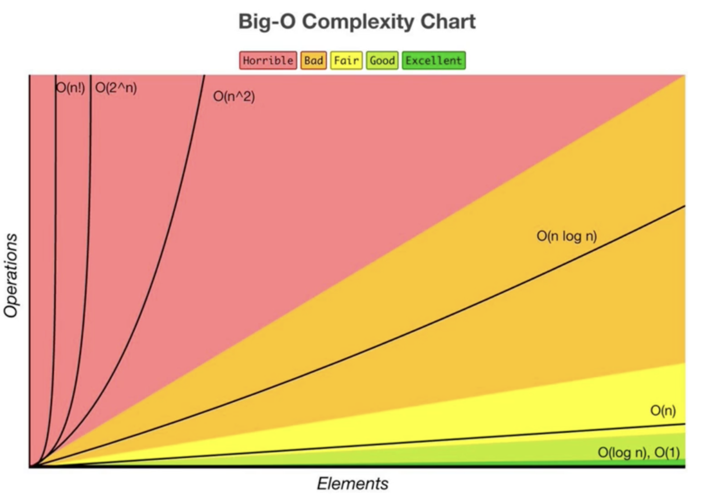

# Big O Notation

## What is a good code?

- Readable: Clean, easy to understand.
- Scalable: Can handle large inputs efficiently.

**Run time complexity** is a way to describe the efficiency of an algorithm. It is a function that describes the amount of time an algorithm takes in terms of the amount of inputs the algorithm has.

**Big O Notation** is a way to describe the efficiency of an algorithm. It is a mathematical notation that describes the limiting behavior of a function when the argument tends towards a particular value or infinity. It allows us to compare the efficiency of different algorithms.



In JavaScript, we can use the `performance.now()` method to measure the time it takes to run a function.

```javascript
const doSomething = () => {
	let t0 = performance.now();
	// code here...
	let t1 = performance.now();
	console.log(`Call to doSomething took ${t1 - t0} milliseconds.`);
};

doSomething();
```

The problem with measuring the time it takes to run a function is that it can vary depending on the machine it is running on. Big O Notation helps us to describe the efficiency of an algorithm in a more abstract way by counting the amount of operations an algorithm performs.

**We need to consider the worst-case scenario when analyzing the efficiency of an algorithm.**

## Big O Notation: O(n) - Linear Time Complexity

**O(n)** describes an algorithm whose performance will grow linearly and in direct proportion to the size of the input data set. The time it takes to run the algorithm will increase in direct proportion to the size of the input data set.

```javascript
function findElement(arr, elem) {
	for (let i = 1; i < array.length; i++) {
		if (arr[i] === elem) {
			console.log(`Element: ${elem} found at index: ${i}`);
		}
	}
}
```

```python
def find_element(arr, elem):
  for i in range(len(arr)):
    if arr[i] == elem:
      print(f'Element: {elem} found at index: {i}')
```

## Big O Notation: O(1) - Constant Time Complexity

**O(1)** describes an algorithm that will always execute in the same time regardless of the size of the input data set. The time it takes to run the algorithm will remain constant.

```javascript
function logFirstElement(arr) {
	console.log(arr[0]);
}
```

```python
def print_first_element(arr):
  print(arr[0])
```

**Inputs can be any type of data, it's not restricted to arrays.**

## Big O Rules

1. **Worst Case**: We need to consider the worst-case scenario when analyzing the efficiency of an algorithm.

```javascript
const inputArray = ['Dora', 'Boots', 'Diego', 'Nemo', 'Swiper', 'Map', 'Backpack'];

function findNemo(arrayOfNames) {
	for (let i = 0; i < arrayOfNames.length; i++) {
		if (arrayOfNames[i] === 'Nemo') {
			console.log('Found Nemo!');
			break;
		}
	}
}

findNemo(inputArray);
```

Even though the function above has a break statement, we need to consider the worst-case scenario where 'Nemo' is the last element in the array.

## Resources

- [ZTM Cheat Sheet](https://zerotomastery.io/cheatsheets/big-o-cheat-sheet/?utm_source=udemy&utm_medium=coursecontent)
